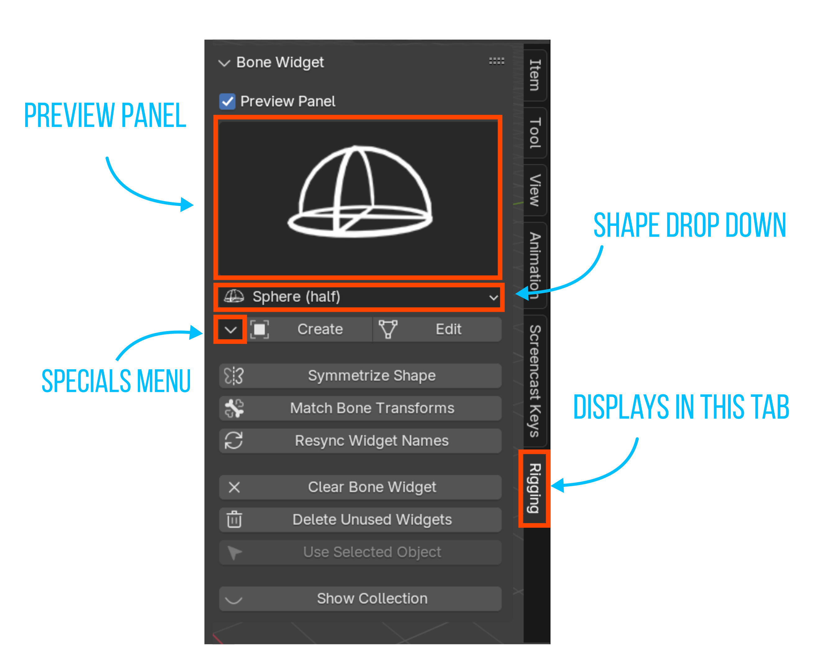
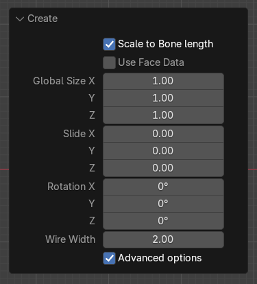

# Bone Widget

2.7 video explanation : https://vimeo.com/184159913

## Description:
Bone Widget is a blender add-on to assist with making custom bone shapes. It has an editable library of shapes that make it easy to apply to any rig.

It ships with many shapes pre-made but you can also add your own to the library to make rigging easier.

## Installation:

1. Download the zipped code here from Github.

2. In Blender, open Preferences->Addons->Install. Navigate to where you saved the zip file and click install.
3. Enable the Addon with the checkbox.
4. The UI will appear in the properties panel (n panel) in the 3d viewport.

## UI Panel

### Shape:
This is the active shape from Bone Widget Library.
Choose the shape you want to add from the list here.

### BW Specials Menu:

#### Add to Widget library

To add a mesh object to the library, select a mesh object and click this button.
Make sure you give that mesh object an appropriate name before adding.

#### Remove from Widget Library

This will remove the active shape from the library.
Select the shape you want to remove from the list.  And click this. Boom, it is gone (forever!).

### Creating a Widget:

#### Create:
Select a bone (or bones), choose the shape from the drop down menu, then press create.
This will create a widget object for each of the selected bones.  The widget objects will be placed in a collection that is specified in the user preferences.  You can also specify the prefix for the widget names there too.

#### Redo panel

#### Scale to bone length:
When enabled the Global Size will be multiplied by the bone length.  (ie - the widget  will be relative size to the size of the bone)
With this disabled, the Global Size will be in Blender units.

#### Slide:
This will slide the position of the widget along the Y axis (or length) of the bone.  0.0 is at the head of the bone and 1.0 is the tail.  (negative values are possible too)

#### Rotation X/Y/Z
You can rotate the widget by these values at the time of creation.  This can save you from having to jump into edit mode to rotate a widget to better align with your situation.

#### Edit/Jump to Bone:
When in pose mode, this will jump into edit mode for the custom bone shape and allow you to edit it.
When you have the shape selected (object or edit mode), this button will display as "Jump to Bone".  That will take you back to pose mode, if that mesh object is in face a custom shape.

#### Match bone Transforms:
If the widgets get out of alignment with the location of the bone itself, this operator will snap the selected widget to the matrix of the bone.  It works if you have the bone(s) selected or if you have the widget object(s) selected.

<b>Note:</b>
Currently bone widget is designed to work with a “bone scale” setting of 1.0.  So this feature won't work correctly for the cases where the bone scale is not 1.

#### Resync Widget Names:
Sometimes you might rename a bone/or a widget.  This operator will loop through all the custom bone shapes and make sure they match the name of the bone they are assigned to.

<b>Note:</b>
Currently the add-on is designed to have one widget per bone, if you have multiple users of the same widget, it will be renamed to the last user it finds.

#### Clear Bone Widget:
This will clear the custom bone shapes from all the selected bones.

#### Delete Unused Widgets:
This operator will loop through the widget collection and delete anything that isn't being used.  This helps keep things tidy.

#### Use Selected Object:
If you want to apply a mesh object that is already in your scene as a custom shape, you can use this option.
First select the mesh shape you want to use (object mode), then shift select the armature, switch into pose mode and make sure you select any bone(s) you want this shape to be applied to.  Then press the button.

#### Hide/Show Collection:
As the name would suggest this will toggle the visibility of the widget collection.

### To Do:
- complete the documentation with images to this readme file
- [Feature] Let the user change the widget suffix to a prefix for a different naming convention
- [Feature] Extract and edit a widget?  Say you're editing a rig that doesn't have mesh objects for the widgets in the file (only mesh data).
Maybe there can be a way of extracting them and making them real objects.
- [Bug] The match Bone Transforms does not work well when the bone scale is not at 1.0
- [Bug] if the collection doesn't exist you can't edit widgets
- [enhancement] doesn't work well with Rigify
- [bug] collection needs to be in the master scene for the addon to find it.

Possible bugs:
What if the widget isn’t actually in the file? Ie - not a real object

## v1.8 Release Notes:
* Fix: updated to work with Blender 2.93/3.0
* Functionality change: If you are editing a Widget that already exists, it now will use the collection where it is actually located rather than trying to find it in the user preferences settings (fixes error if the collection was called something different)
* changed the default collection name and widget names to better match with Rigify (not my preferred naming convention but its better to have more consistency)
* Removed PayPal funding links
* Removed Logger
* Functionality change: I rewrote the way to add the selected object as a widget without having to read and write to a text file
* Fix: If collection is 'excluded' in the outliner it now re-enables it

### Widget Edits (from v1.7)
* Resized '3 Axes' widget to better match a default size of 1 blender unit (and sits over the 6 axes nicely)
* Renamed 'FK_Limb' to 'FK Limb 1'
* Renamed 'Arm' widget to 'FK Limb 2'
* Renamed widgets to exclude the underscore (for consistency)
* Lowered the resolution of the 'Chest' widget (makes it difficult to edit when it was so high poly). Resized it to 1 blender unit in the Y and aligned it to the +y axis by default
* Lowered the resolution of "Arrow Double Curved"
* Added a thicker version if the arrow called "Roll 3"
* Lowered the resolution of "Torso"
* Added "Torso 1" shape
* Aligned "Eye Target" to the Y axis, renamed to "Eye Target 1", resized.
* Added "Eye Target 2" shape
* Straightened the "Clavicle" shape (makes it more flexible)
* Gear Complex/Gear Simple - aligned to world space
* Rename Finger to "Paddle (square)"
* Added a variation of "Paddle (rounded)" with a round end
* Aligned "Plane" with the Y axis (will 'slide' in a logical direction out of the box)
* Added a "Plane (rounded)" which has rounded corners
* Rotated "Roll" slightly so it looks symmetrical, Renamed to "Roll 1"
* Added "Roll 2"
* Added "Arrow Single Straight" and "Arrow Double Straight"
* Added "Saddle" shape - useful for chests and head controls as a starting point
* Added "Rhomboid" shape
* Flipped "Arrow Head" and renamed to "Pyramid"

## v1.7 Release Notes
* Fix: Allow rename of Addons-Folder
* Fix: Fixed the symmetrize error if the .L or the .R didn't have a widget
* Fix: Symmetrize Operator caused Error when clicking in Object mode
* Fix: Return to Armature: Didn't unselect widget-object before returning to armature
* Fix: Edit Widget: Show only if active bone has a widget
* Feature: Widgets renamed: Gear --> Gear_complex, Root --> Root_1
* Feature: New Widgets: 3 Axes, 6 Axes, Arrow_double_sided, Arrow_head, Chest, Clavicle, Eyes_Target, FK_Limb, Gear_simple,
Roll, Root_2, Torso
* Feature: New Property: Panel Category
* Feature: New Property: Bone Widget symmetry suffix
* Feature: Add selected Mesh as widget-shape
* Feature: Added Logger

## v1.6 Release Notes
* Fixed the "DELETE UNUSED WIDGETS" function (was crashing because the context was wrong)

## v1.5 Release notes
* fixed the symmetrize error if the .L and .R were sharing the same shape and you tried to symmetrize

## v1.4 Release notes
* add function to clear widget from bone
* add operator to show/hide the collections
* add operator that will resync the names of the wdgts to the bones
* add operator to delete unused widgets
* add property to be able to rotate the widgets
* improve the ui
* add some default widgets (line, cube, half cube, circle, gear, triangle)
* fixed bug when 'custom bone transform' is enabled, size is incorrect

## v1.3 Release Notes:
* updated to work with latest 2.8 api
* added user preferences for the widget prefix and the collection name
* doesn't delete old widget when replacing with a new version [resolved]
* it will only match the bone matrix when the armature is at a scale of 1.0  This is because the old id_data used to point to the object, but now it points to the data object. [resolved]
* also doesn't match bone transforms if armature not at 0,0,0 [resolved]
* doesn't work correctly when there is a "custom shape transforms" [resolved]
* match Bone Transforms works when bone is selected but not when the widget is selected [resolved]
* if the widget names end with .001 etc it will throw an error [resolved]
* if no objects are selected it will throw an error [resolved]
