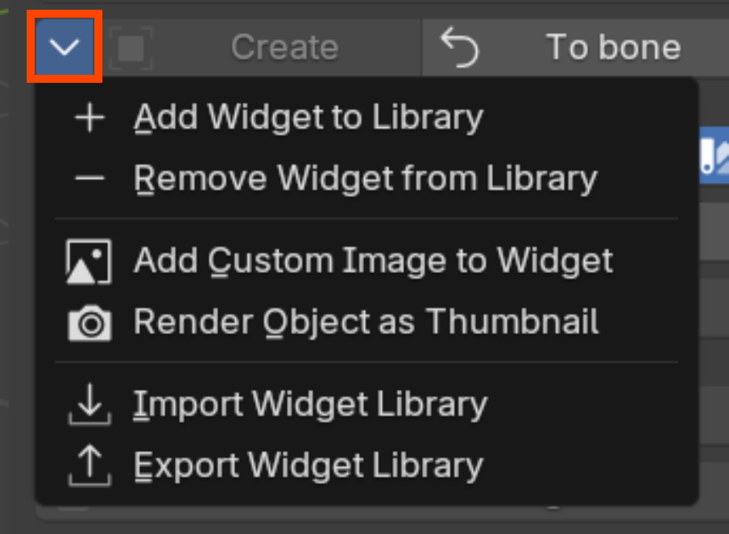
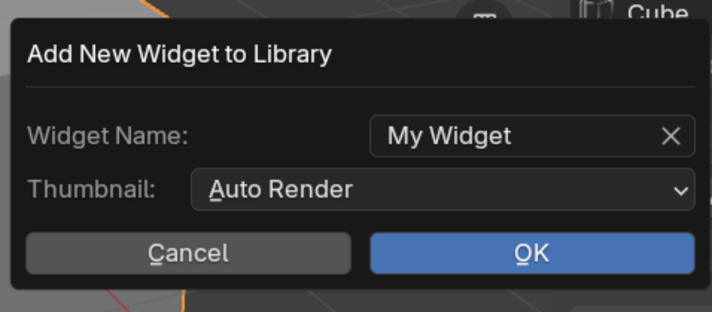
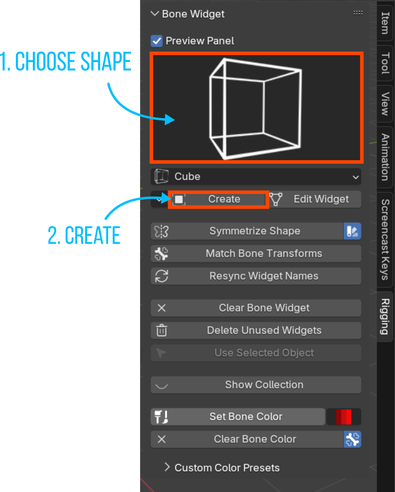
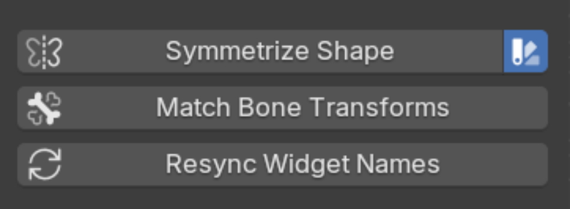
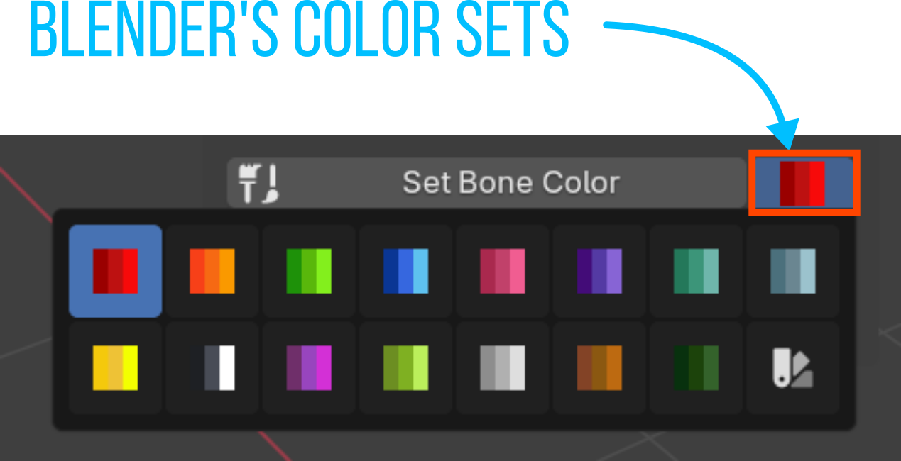
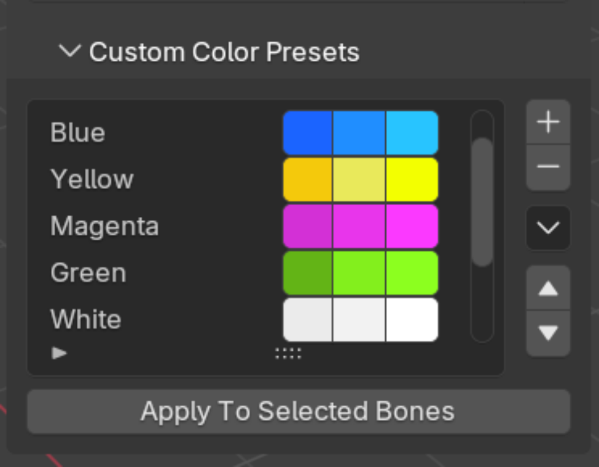
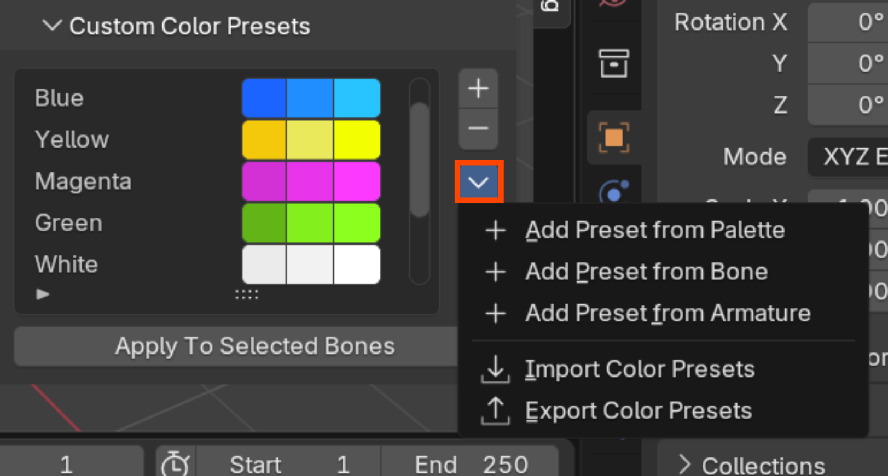
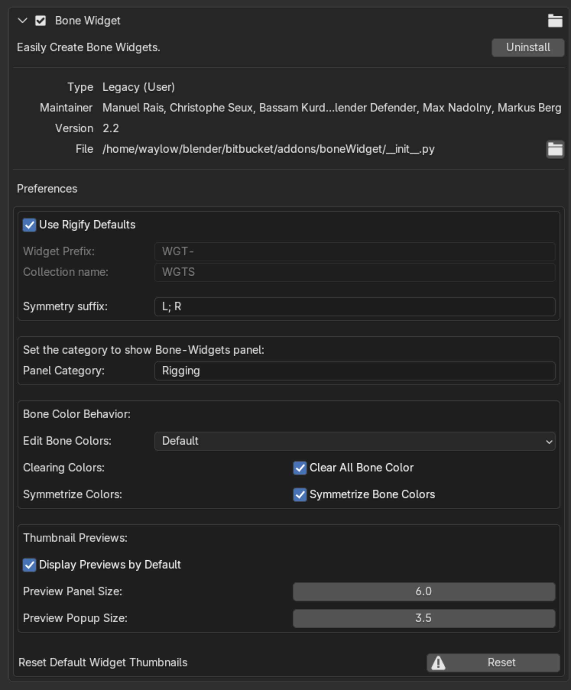

# Bone Widget

Video Trailer:  

https://www.youtube.com/watch?v=QiCw-7Ok3jY

## Description:
Bone Widget is a blender add-on to assist with making custom bone shapes. It has an editable library of shapes that make it easy to apply to any rig.

It ships with many shapes pre-made but you can also add your own to the library to make rigging easier.
It also has many features that make managing bone colors a breeze.

## Installation:

1. Download the zipped code here from Github. (Check in the release tab for the latest stable release)
2. In Blender, open Preferences->Addons->Install. Navigate to where you saved the zip file and click install.
3. Enable the Addon with the checkbox.
4. The UI will appear in the properties panel (n panel) in the 3d viewport.

## UI Panel

### Preview Panel Checkbox:
This will show/hide the large widget preview panel. It's also possible to set your preferred option for this in the preferences. (The default is enabled)

### Preview Panel:
This is the large preview panel that displays the currently selected widget.  Click on this panel to open the selection menu.

### Shape Drop Down:
This is the active shape from Bone Widget Library. This is an alternate way to access the shape library (as you can choose to hide the preview panel if you wish).

## BW Specials Menu:
 

## Add New Widget to library
   

To add a mesh object to the library, select a mesh object and click this button.
Give the mesh object an appropriate name, and decide how you want the add-on to handle the thumbnail image.
You can choose:  
- **Auto-Render (default)**  
This will render the object as a wireframe image and save it to the add-on data location.  
- **Custom Image**  
If you already have an image you want to use, this will open a file browser so you can select it.  The image will be copied to the add-on data location.
- **Use Placeholder**  
There is a placeholder image that the add-on will use if you chose this option.

After deciding on the thumbnail, click confirm and you are done.  Your widget will be added to the library.  
User widgets are stored in a separate json file to the shapes that come with the add-on.  
Also if the mesh has faces, this will be saved as well. You can choose to show the faces or not when you add this widget to a bone.

## Remove from Widget Library

This will remove the active shape from the library (and the thumbnail).  
Select the shape you want to remove from the list.  And click this. Boom, it is gone (forever!).  
This will work on any widget in the list.

### Add Custom Image to Widget

Open a file browser to choose an image for the active widget.  This image will be copied to the add-on data location.

### Render Object as Thumbnail

This operator will render a wireframe version of the active object.  It is designed if you need more control over how a widget thumbnail looks if you are not satisfied with the automatic version.  The object will be centered from the current vantage point, so set up the viewport to capture the angle you want and then activate the operator.
There are also options to change the wire color and thickness in the redo panel. 

### Import/Export Widget Libray

It is possible to import and  export all the custom widgets that you have added to/from a zipped json file.  This will let you more easily share them with another computer. 

> [!CAUTION]
>
> A note on updating the add-on:
>Version 2.1 is the first version to support importing/exporting.  Versions prior to this have a slightly different structure that are not compatible with 2.1 onwards.  If you already have widgets that you'd like to reuse, the easiest way would be to open the rig file that uses them and then 'add to library' in the newer version.
>
>Also before you update to a version after 2.1, make sure you export your custom widgets so it's possible to import them easily.  This is the easiest way to keep your existing work for the moment. 

## Creating a Widget:

## Create:
 

Select a bone (or bones), choose the shape from the drop down menu, then press create.  
This will create a widget object for each of the selected bones.  
The widget objects will be placed in the collection that is specified in the user preferences.

### Redo panel

 

#### Scale to Bone Length:
When enabled the Global Size will be multiplied by the bone length.  (ie - the widget  will be relative size to the size of the bone)
With this disabled, the Global Size will be in Blender units.

#### Use Face Data:
Some premade widgets have faces.  If the widget you created has them, you can choose to show them with this setting.  This will either include or exclude them.  (when you add a widget to the library if it has faces, they will be recorded)

#### Global Size:
This will be the size of the widget, relative to the size of the bone if 'Scale to bone length' is enabled.  Or in Blender units if that setting is disabled.

#### Global Size XYZ: (Advanced Option only)
When the advanced options is enabled you can access the individual scale channels of the created widget, rather that 1 scale value for all 3 axes

#### Slide:
This will slide the position of the widget along the Y axis (or length) of the bone.  0.0 is at the head of the bone and 1.0 is the tail.  (negative values are possible too)

#### Slide X/Y/Z (Advanced Option Only)
When advanced mode is enabled, the slide property is split into 3 axes rather than just the default y axis.

#### Rotation X/Y/Z
You can rotate the widget by these values at the time of creation.  This can save you from having to jump into edit mode to rotate a widget to better align with your situation.

#### Wire Width:
This will let you set the wireframe thickness.  The default setting is 2.0 but Blender will allow any float between 1 and 16. 

#### Advanced Options:
This checkbox will switch the slide value into 3 axes rather than just the default Y axis.  This will enable the user to position the widget in some situations without having to jump into edit mode.

### Edit/To Bone:
When in pose mode, this will jump into edit mode for the custom bone shape and allow you to edit it.
When you have the shape selected (object or edit mode), this button will display as "To Bone".  That will take you back to pose mode, if that mesh object is in fact a custom shape.

> [!NOTE]
> <b>Creating and Editing Shapes:</b> 
>When you 'Create' a shape, it will always be placed in the collection set in the user preferences. 
>If you 'Edit' a shape, it will stay in whatever collection that widget was already located.

## Symmetrize Shape

If a bone has a .L or .R, you can copy the shape over to the other side.  This will create a duplicate widget object rather than using changing any of the display transforms to mirror the same shape.  (The add-on is designed to have 1 shape per bone)

### Symmetrize Bone Colors:
When enabled and you symmetrize a bone widget, it will also copy the bone colors.  When disabled, it will not edit any colors at all when you symmetrize a widget.

### Match Bone Transforms:
If the widgets get out of alignment with the location of the bone itself, this operator will snap the selected widget to the matrix of the bone.  It works if you have the bone(s) selected or if you have the widget object(s) selected.

### Resync Widget Names:
Sometimes you might rename a bone/or a widget.  This operator will loop through all the custom bone shapes and make sure they match the name of the bone they are assigned to.  
Currently the add-on is designed to have one widget per bone, if you have multiple users of the same widget, it will be renamed to the last user it finds.

### Clear Bone Widget:
This will clear the custom bone shapes from all the selected bones.

### Delete Unused Widgets:
This operator will loop through the widget collection and delete anything that isn't being used.  This helps keep things tidy.

### Use Selected Object:
If you want to apply a mesh object that is already in your scene as a custom shape, you can use this option.
First select the mesh shape you want to use (object mode), then shift select the armature, switch into pose mode and make sure you select any bone(s) you want this shape to be applied to.  Then press the button.

### Hide/Show Collection:
As the name would suggest this will toggle the visibility of the widget collection.  
<b>Note:</b>  
This will only toggle the visibility of the designated widget collection (set in the preferences).  If your character has widgets outside of this collection, it will not be able toggle the visibility of that collection.

---
# Bone Colors

As of version 2.2, Bone Widget will let you manage the colors for bones in Pose Mode (and Edit Mode if you change the user preferences).
The normal way Blender handles bone colors is with 15 predefined Bone Color Sets (and 5 blank ones), the 'default' colors, or by using a custom color set.  
It is also possible to display different colors for both Edit Mode and Pose Mode, however, if the Pose bone colors are set to 'default' and there is any color on the Edit bone, the Edit bone color will override the Pose bone color.

The add-on will always add the colors to Pose bones but you can decide how you want it to handle Edit bone colors in the user preferences.
You can choose Default, Linked, or Separate.
**Default** will leave the Edit bone colors at 'default'.
**Linked** will use the same colors for both modes.
**Separate** will let you set different colors for Edit Mode and Pose Mode.

You can easily use any of Blender's Bone Color Sets (including 'Custom') with the "Set Bone Color" button and color palette.
But the add-on can also store your own preferred color sets which you can reuse over and over. 

## Set Bone Color
This will set the color of the selected bones to colors in the adjoining color palette. It will add color to the Edit Bones and/or Pose bones depending on your user preference (out of the box this will just be the Pose bones). 

## Color Palette
Click on this to choose from Blender's predefined Bone Color Sets.  The last one in the menu is the custom color set.  Choosing this will display a color palette for 3 colors.

From left to right, they are for **normal**, **selected**, and **active**.
**Normal** is the color when the bone is not selected (or active).
**Selected** is the color when the bone is selected (but not active).
**Active** is the color when the bone is active.

## Clear Bone Color
Clicking this will reset the color of the selected bones back to 'default'.  If the adjoining bone icon is active (called "Clear All Bone Color"), it will remove the color from both Edit mode and Pose mode.  Or if it is disabled, it will only remove the color from the active mode (Edit mode or Pose Mode).

# Custom Color Presets
Toggle open this section to see all your saved color presets.  

|Icon| Function|
|--|--|
|| Add a new preset|
|| Delete the active preset|
|| Preset specials menu|
|| Move the active preset up in the list |
|| Move the active preset down in the list |

### Apply to Selected Bones
This will apply the active preset to the selected bones.

## Color Preset Specials Menu

In this specials menu the first 3 options are for adding presets.  
- **Add Preset from Theme:**  
Add the colors from the custom color pallet in the section above (next to "Set Bone Color").  
- **Add Preset from Bone:**  
Add the colors from the active bone.  
- **Add Preset from Armature:**  
This will detect all the custom colors on any existing armature and launch a dialogue box for you to decide which ones to add to your presets.

### Import/Export Color Presets:
It is possible to import and  export all the color preset that you have added to/from a zipped json file.  This will let you more easily share them with another computer. 

  

## User Preferences:

### Use Rigify Defaults:

With this enabled the add-on will use the same naming convention for the widget prefix and collection name as Rifigy.  If this setting is disabled you can set them to your preference.

### Widget Prefix:
If the "Use Rigify Defaults" is disabled, the add-on will append this text to the start of every new widget created.

### Collection Name:
If the "Use Rigify Defaults" is disabled, the add-on will use this as the collection to place all the newly created widgets.  If a widget already exists when you edit it, it will stay in the collection it already belongs to.  The add-on will not move existing widgets.

### Symmetry Suffix:
This will let you set the suffix that is appended to the end of the symmetrical widgets.

### Panel Category:
This is the name of the panel the add-on will be displayed in. 

## Edit Bone Colors:
Choose how you want the add-on to handle Edit bone colors.  

**Default** - leave the Edit Bone colors at the default setting and only change the Pose Bone colors.  
**Linked** - Use the same colors for both Edit Bones and Pose Bones.  
**Separate** - Use a different color for both Edit Bones and Pose Bones (you will have to set them in each mode) 

## Clear All Bone Color/Symmetrize Bone Colors:

This is alternate access to the the booleans that were explained earlier.

**Clear All Bone Colors**  
When enabled and you clear the bone colors, it will reset both Edit Bone and Pose Bone colors back to default.  When disabled, it will only clear the colors in the active mode (Edit mode or Pose Mode)

**Symmetrize Bone Colors**  
When enabled and you symmetrize a bone widget, it will also copy the bone colors.  When disabled, it will not edit any colors at all when you symmetrize a widget.

### Display Previews by Default
This boolean will let you set the default state of the Preview Panel.
You will still be able to turn in on/off with the checkbox in the main ui, but advanced users probably don't need to see the large preview all the time.

### Preview Panel Size:
You can set the size of the Preview window with this setting.

### Preview Popup Size:
This will set the size of the images when you activate the popup widget panel.

### Reset Default Widget Thumbnails:
If you have accidentally (or purposefully) changed the images for any of the widgets that the add-on ships with, this operator will reset them back to their original images.

---
# v2.2 Release notes
- [Added] **Bone Colors**
	- Add colors to the Pose bone widgets
	- User preference to also change the Edit mode colours (disabled by default) 
	- Add any of Blender's default color themes from the pop-up menu or set your own custom color
	- Save your own color presets (these cannot be shown in the popup menu as yet)
	- Color Ripper: detect all the colors from an existing rig and decide which sets to add to your presets
	- Various other color functions
		- reorder the preset list
		- add from active bone
		- add from palette
		
- [Added] **Auto render thumbnails** when adding widgets to library  
When adding a widget to the library you can use a custom image, the place holder image or automatically render the object

- [Added] **Render a thumbnail** of the active object
You can chose to render out a thumbnail of the active object to the current working (mesh object type only).  This will give you more options to change the thickness of the wireframe or even edit the output with an external editor before adding it as a custom image for any widget.  Or perhaps printing it and sticking it on your fridge.  The choice is yours.

- [Adjusted] **Widget tweaks**.  The face data on several widgets was repaired, and some widgets where reoriented to better suit the most logical starting orientation.  

-  [Adjusted] The **slide** value(s) will always work relative to the bone length rather than world scale (when global scale is enabled).  This makes it easier to set consistent size widgets on different length bones.

## v2.1 Release Notes:
- [Added] Markus Berg added functionality to display images of the widgets. What a flippin' legend.
- [Added] Markus split the scale and slide into 3 axes and implemented toggle to show simple/advanced mode
- [Added] Popup added for name input when adding a widget to the library
- [Added] import/export user library of shapes
- [Added] you can now add custom images to the widgets (or use the in-built image place holders)
- [Added] added wire width option when the widgets are created
- [change] remove the "_old" functionality of the code (just delete the old widget)
- [fix] the match bone transforms now takes the custom shape transforms into account
- [fix] if the collection didn't exist when you tried to delete unused widgets it would throw an error.  You now get a message that hints at the problem.
- [fixed] If there is no active object the panel.py would throw an error
- [fixed] If you Symmetrized the Shape in pose mode with no widget added, it will throw an error.

## v2.0 Release Notes:
- changed the default name of the n panel to 'Rigging' rather than 'Rig Tools'
- [fixed Bug] if the bone was using an override transform, it will use this bone mirror the widget to rather than just taking that bone's matrix
- [Enhancement] Added setting in the user preferences so it can optionally use the Rigify naming convention for widget creation (collection and widget names).

## v1.9 Release Notes:
- [Fix] widget collection no longer needs to be in the master scene for the add-on to find it.
- [Fix] All the related functions now search for the collection recursively so the structure of the Widget Collection location doesn't matter.
- [Fix] change the mirrorShape function to only display in pose mode to avoid errors.

## v1.8 Release Notes:
* Fix: updated to work with Blender 2.93/3.0
* Functionality change: If you are editing a Widget that already exists, it now will use the collection where it is actually located rather than trying to find it in the user preferences settings (fixes error if the collection was called something different)
* changed the default collection name and widget names to better match with Rigify (not my preferred naming convention but its better to have more consistency)
* Removed PayPal funding links
* Removed Logger
* Functionality change: I rewrote the way to add the selected object as a widget without having to read and write to a text file
* Fix: If collection is 'excluded' in the outliner it now re-enables it.

## v1.7 Release Notes
* Fix: Allow rename of Addons-Folder
* Fix: Fixed the symmetrize error if the .L or the .R didn't have a widget
* Fix: Symmetrize Operator caused Error when clicking in Object mode
* Fix: Return to Armature: Didn't unselect widget-object before returning to armature
* Fix: Edit Widget: Show only if active bone has a widget
* Feature: Widgets renamed: Gear --> Gear_complex, Root --> Root_1
* Feature: New Widgets: 3 Axes, 6 Axes, Arrow_double_sided, Arrow_head, Chest, Clavicle, Eyes_Target, FK_Limb, Gear_simple,
Roll, Root_2, Torso
* Feature: New Property: Panel Category
* Feature: New Property: Bone Widget symmetry suffix
* Feature: Add selected Mesh as widget-shape
* Feature: Added Logger

### Widget Edits (from v1.7)
* Resized '3 Axes' widget to better match a default size of 1 blender unit (and sits over the 6 axes nicely)
* Renamed 'FK_Limb' to 'FK Limb 1'
* Renamed 'Arm' widget to 'FK Limb 2'
* Renamed widgets to exclude the underscore (for consistency)
* Lowered the resolution of the 'Chest' widget (makes it difficult to edit when it was so high poly). Resized it to 1 blender unit in the Y and aligned it to the +y axis by default
* Lowered the resolution of "Arrow Double Curved"
* Added a thicker version if the arrow called "Roll 3"
* Lowered the resolution of "Torso"
* Added "Torso 1" shape
* Aligned "Eye Target" to the Y axis, renamed to "Eye Target 1", resized.
* Added "Eye Target 2" shape
* Straightened the "Clavicle" shape (makes it more flexible)
* Gear Complex/Gear Simple - aligned to world space
* Rename Finger to "Paddle (square)"
* Added a variation of "Paddle (rounded)" with a round end
* Aligned "Plane" with the Y axis (will 'slide' in a logical direction out of the box)
* Added a "Plane (rounded)" which has rounded corners
* Rotated "Roll" slightly so it looks symmetrical, Renamed to "Roll 1"
* Added "Roll 2"
* Added "Arrow Single Straight" and "Arrow Double Straight"
* Added "Saddle" shape - useful for chests and head controls as a starting point
* Added "Rhomboid" shape
* Flipped "Arrow Head" and renamed to "Pyramid"

## v1.6 Release Notes
* Fixed the "DELETE UNUSED WIDGETS" function (was crashing because the context was wrong)

## v1.5 Release notes
* fixed the symmetrize error if the .L and .R were sharing the same shape and you tried to symmetrize

## v1.4 Release notes
* add function to clear widget from bone
* add operator to show/hide the collections
* add operator that will resync the names of the wdgts to the bones
* add operator to delete unused widgets
* add property to be able to rotate the widgets
* improve the ui
* add some default widgets (line, cube, half cube, circle, gear, triangle)
* fixed bug when 'custom bone transform' is enabled, size is incorrect

## v1.3 Release Notes:
* updated to work with latest 2.8 api
* added user preferences for the widget prefix and the collection name
* doesn't delete old widget when replacing with a new version [resolved]
* it will only match the bone matrix when the armature is at a scale of 1.0  This is because the old id_data used to point to the object, but now it points to the data object. [resolved]
* also doesn't match bone transforms if armature not at 0,0,0 [resolved]
* doesn't work correctly when there is a "custom shape transforms" [resolved]
* match Bone Transforms works when bone is selected but not when the widget is selected [resolved]
* if the widget names end with .001 etc it will throw an error [resolved]
* if no objects are selected it will throw an error [resolved]
